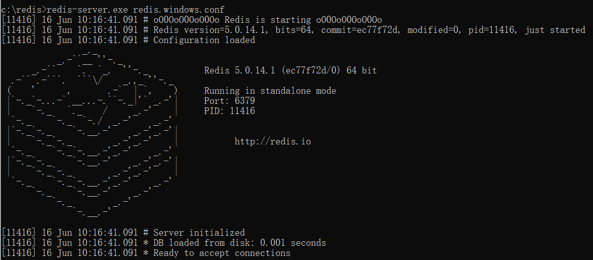
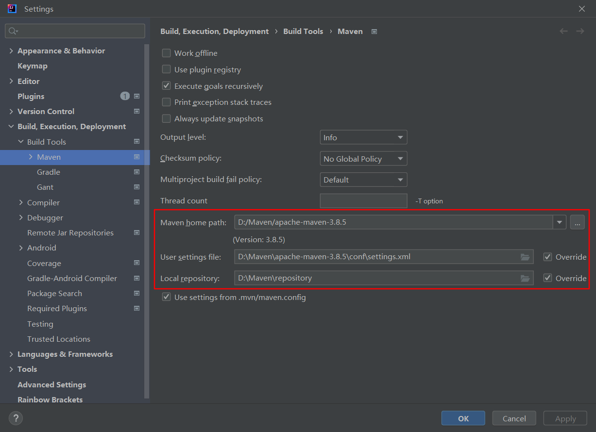
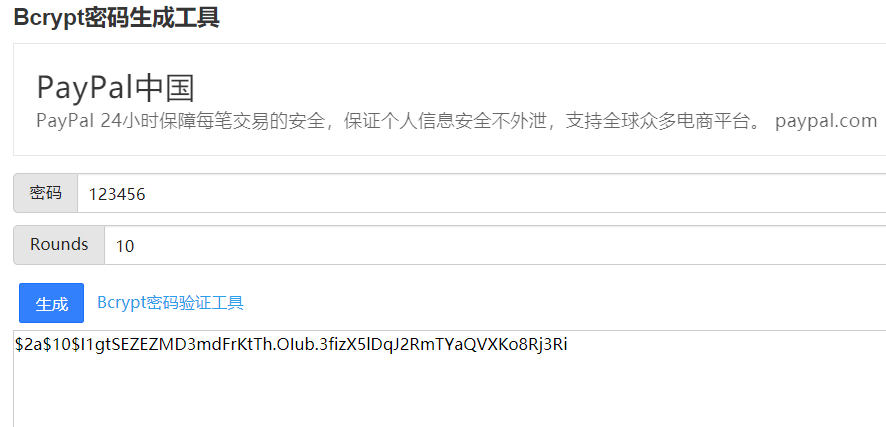

# ReadMe

## 环境安装

这里列出本项目实现安装的环境以及相关的安装教程

1. Java JDK 1.8+

   安装指南：https://blog.csdn.net/liangjiubujiu/article/details/79171347

   安装路径：C:\Program Files\Java\jdk1.8.0_151


2. Redis

   安装指南：https://www.runoob.com/redis/redis-install.html

   下载链接：https://github.com/tporadowski/redis/releases

   下载版本：[Redis-x64-5.0.14.1.zip](https://github.com/tporadowski/redis/releases/download/v5.0.14.1/Redis-x64-5.0.14.1.zip)

   安装路径：C:\redis

3.  Maven 安装

   安装指南：https://www.runoob.com/maven/maven-setup.html

   下载地址：https://maven.apache.org/download.cgi

   下载版本：[apache-maven-3.8.5-bin.zip](https://dlcdn.apache.org/maven/maven-3/3.8.5/binaries/apache-maven-3.8.5-bin.zip)

   下载路径：D:\Maven\apache-maven-3.8.5

4. MySQL安装

   安装教程：https://www.runoob.com/mysql/mysql-install.html

   下载路径：https://dev.mysql.com/downloads/installer/

   安装版本：**Windows (x86, 32-bit), MSI Installer**  8.0.29  439.6M

   安装路径：D:\MySQL

5. Node安装

   安装教程：https://blog.csdn.net/lewky_liu/article/details/87959839

   安装版本：**16.15.0**

   安装路径：C:\Program Files\nodejs\

   设置镜像

   ```
   npm config set registry https://registry.npm.taobao.org
   配置后可通过下面方式来验证是否成功
   npm config get registry
   ```

## 启动项目

1. 先开启redis

   通过 win + R 进入命令行窗口

   ```
   cd c:/redis
   redis-server.exe redis.windows.conf
   ```

   

显示以上界面即为redis启动成功

2. 开启后端

   1. 打开 `joyy-backend`后，先配置 `maven`环境，确保是路径正确

   

   ​		每次开启一个新的maven project 都要记得进入 maven setting 检查 maven path！

   2. 配置 JDK 环境，注意，该项目要用 `JDK1.8`版本，版本高于1.8会出错。环境配置包括以下两个部分

      1.  File -》 Project Structure -》 SDKs
      2.  File -》 Project Structure -》 Project Settings -》 Modules
      3.  Maven Settings -》 Build, Execution, Deployment -》 Compiler -》 Java Compiler
      4.  Maven Settings -》 Build, Execution, Deployment -》 Compiler -》User-local build process VM options(overrides Shared options) 设置为-Djps.track.ap.dependencies=false

      注意：设置完成后要点击Apply， ok

   3. 安装依赖

      ```
      maven clean
      maven install
      ```

   4. 构建数据库

      打开数据库，创建一个新库 `eladmin`，导入sql文件夹中的初始化脚本库脚本 `eladmin.sql`，运行

      此外，还需要 运行 `sys_report.sql`

      修改配置，如果数据库密码不是 123456，那么需要在 src/main/resources/application.yml 配置文件中做相应的修改

   5. run src/main/java/com/jeff/EladminBackendApplication.java 

3. 开启前端

   1. 在命令行输入 npm install 安装所需的包

   2. 进入 joyy-vue\package.json 执行

      ```
      npm run serve
      ```

4. 前后端都开启后，即可进入 http://localhost:8080/login

## 密码加密

数据库中存储的密码是经过加密的，加密算法为 Bcrypt，可以通过[Bcrypt密码生成工具][https://www.bejson.com/encrypt/bcrpyt_encode/]生成加密密码存入数据库。



## 权限管理

- 新增的用户除了要在 `sys_user`数据表加入信息，还需要在`sys_users_roles`表进行增加关联信息

- 新增的功能，除了要在`eladmin`中增加对应的表，还需要在以下数据表增加关联数据

  ```
  sys_menu
  sys_roles_menus
  ```

  - 以新增的`sys_report`为例

    ```
    创建新表 sys_report
    在sys_menu 加入对应menu信息
    在sys_roles_menus 加入对应信息
    ```

## 参考链接

[EL-ADMIN后台管理系统][https://github.com/elunez/eladmin]

[ELADMIN-WEB][https://github.com/elunez/eladmin-web]

